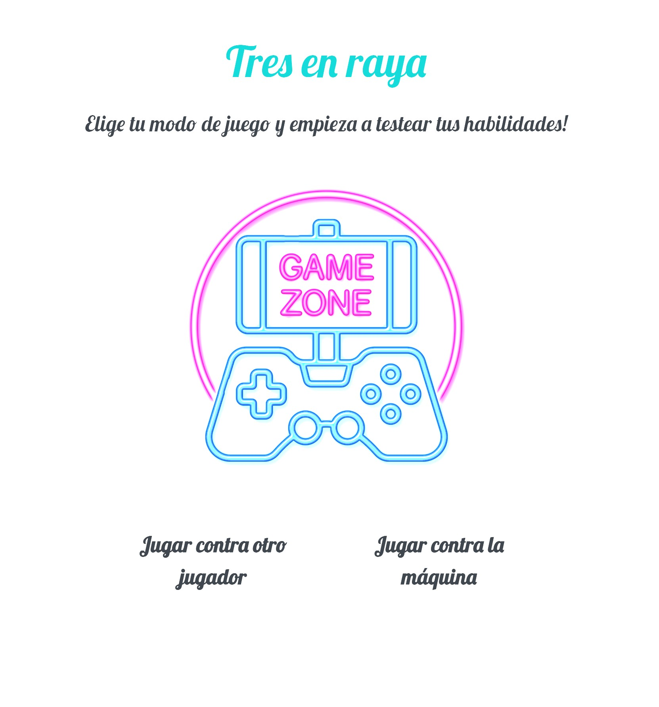

# Tic Tac Toe Game!

## About 

The objective of this project is to create a program that allows us to play tic tac toe against a human opponent or against the machine.

## Getting Started 

You can start a new game by entering your
name and choosing the game mode (human vs human or human vs
machine).
Once the game starts you will see in the side panel whose turn is it to play, each player will have a maximum of 3 tokens in play and you would only be able to play them on free positions

## Local Usage

1. Clone the repository
2. Go live with any code editor
3. Enjoy!

## Stack

 
 

## Views

 
Welcome page:

    
Input names page:

  
Board page:

  

## Deploy 🚀

Be my guest and try out the game! 
 <a href="https://fran1893.github.io/tic_tac_toe/" target="_blank">Here is the demo, HAVE FUN!!</a>

